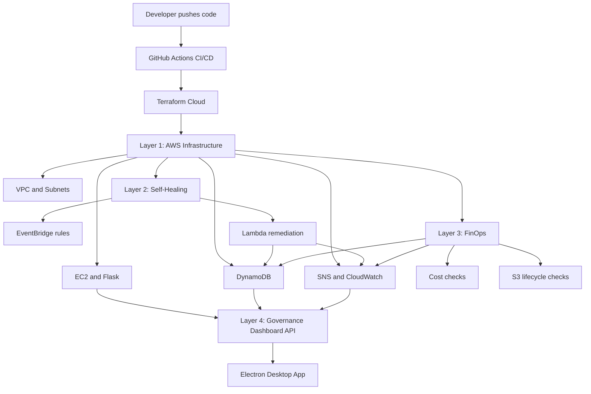

# Autonomous Cloud Governance Platform

Autonomous Cloud Governance is a working AWS cloud operations project that combines infrastructure provisioning, self-healing automation, FinOps checks, monitoring APIs, and an Electron dashboard into one demo-ready platform.

The project is designed to show how a cloud engineering team can move from manual incident response to automated governance:

- provision infrastructure with Terraform Cloud
- deploy and monitor a Flask service on EC2
- react to CloudWatch and EC2 state events with EventBridge and Lambda
- store incident evidence in DynamoDB
- send notifications through SNS
- expose operational data through API endpoints
- view the platform from a desktop governance dashboard

## Current Status

Status: demo ready

Last verified: May 2026

Region: `ap-southeast-1`

Live Flask endpoint:

```text
http://13.228.240.37:5000
```

Recently verified:

- Terraform Cloud apply completed successfully
- AWS infrastructure was created and updated without destroying resources
- Lambda packaging works for Terraform remote runs
- EC2, Flask API, DynamoDB, SNS, CloudWatch, EventBridge, and Electron dashboard flows were checked

## Architecture



## Layers

| Layer | Purpose | Main components |
|---|---|---|
| Layer 1 | Core AWS infrastructure | VPC, public/private subnets, EC2, security groups, DynamoDB, SNS, CloudWatch |
| Layer 2 | Self-healing | EventBridge rules, Lambda self-healing function, CloudWatch alarm handling |
| Layer 3 | FinOps | Scheduled Lambda checks, cost anomaly workflow, S3 lifecycle workflow |
| Layer 4 | Governance dashboard | Flask API, Electron desktop monitor, incident/status/cost views |

## Repository Structure

```text
autonomous-cloud-governance/
├── .github/workflows/deploy.yml
├── app/
│   ├── app.py
│   ├── requirements.txt
│   └── tests/
├── dashboards/
│   └── governance-dashboard.json
├── docs/
│   ├── DEMO.md
│   └── PROJECT_STATUS.md
├── electron-app/
│   ├── index.html
│   ├── main.js
│   ├── package.json
│   └── preload.js
├── lambda/
│   ├── cost_anomaly.py
│   ├── finops.py
│   ├── s3_lifecycle.py
│   └── self_healing.py
├── playbooks/
└── terraform/
    ├── main.tf
    ├── outputs.tf
    ├── variables.tf
    └── modules/infrastructure/
```

## Key API Endpoints

| Endpoint | Purpose |
|---|---|
| `/` | Service status |
| `/health` | Health check for CI/demo validation |
| `/metrics` | Basic governance feature flags |
| `/api/cpu` | EC2 CPU history from CloudWatch |
| `/api/status` | EC2 instance state |
| `/api/incidents` | Recent incident records from DynamoDB |
| `/api/lambda-stats` | Lambda invocation/error stats |

## Local Backend Run

```powershell
cd app
python -m venv .venv
.\.venv\Scripts\Activate.ps1
pip install -r requirements.txt
python app.py
```

For local testing with different AWS resources, set environment variables before starting the app:

```powershell
$env:AWS_REGION = "ap-southeast-1"
$env:EC2_INSTANCE_ID = "i-0327c7e7774cbc046"
$env:DYNAMODB_TABLE = "cloud-governance-incident-log"
$env:DB_PATH = "data.db"
python app.py
```

## Electron Dashboard

```powershell
cd electron-app
npm install
npm start
```

The dashboard currently points to:

```text
http://13.228.240.37:5000
```

If the EC2 Elastic IP changes, update `BASE_URL` in `electron-app/preload.js`.

## Terraform Deployment

Terraform runs through HCP Terraform:

```powershell
cd terraform
terraform init
terraform plan
terraform apply
```

Important packaging note:

The Terraform module packages Lambda functions from:

```text
terraform/modules/infrastructure/lambda/
```

Keep these source files committed:

```text
terraform/modules/infrastructure/lambda/cost_anomaly.py
terraform/modules/infrastructure/lambda/s3_lifecycle.py
```

They are required by the `archive_file` data sources during Terraform Cloud remote runs.

## CI/CD

The GitHub Actions workflow runs:

1. Python test job for the Flask app
2. Terraform init and plan
3. EC2 app deployment through AWS Systems Manager on pushes to `main`

Required GitHub secrets:

```text
TF_API_TOKEN
AWS_ACCESS_KEY_ID
AWS_SECRET_ACCESS_KEY
```

## Demo Flow

Use `docs/DEMO.md` as the presentation script.

Recommended live demo path:

1. Show GitHub Actions and Terraform Cloud run history
2. Open the Flask health endpoint
3. Open the Electron dashboard
4. Trigger or show a self-healing incident
5. Show DynamoDB incident evidence
6. Show Lambda/CloudWatch metrics
7. Explain FinOps scheduled automation

## Operational Notes

- Remove unused Terraform Cloud variables such as `db_password` if the workspace warns that they are undeclared.
- Watch AWS cost after demos, especially EC2, Elastic IP, CloudWatch logs, and NAT-related resources.
- Keep Terraform state managed only by Terraform Cloud.
- Avoid editing infrastructure manually in AWS unless the drift is intentional and documented.

## Resume Summary

Built an Autonomous Cloud Governance Platform on AWS using Terraform Cloud, GitHub Actions, Flask, Lambda, EventBridge, DynamoDB, SNS, CloudWatch, and Electron. The platform provisions infrastructure as code, monitors EC2 health, performs event-driven self-healing, records incidents, supports FinOps automation, and displays governance status in a desktop dashboard.
