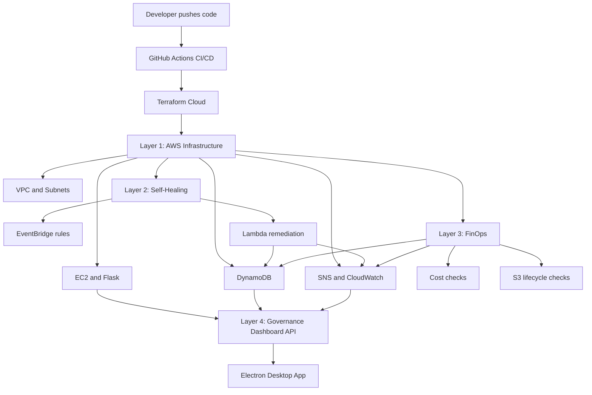

# Autonomous Cloud Governance Platform

Autonomous Cloud Governance is a demo-ready AWS cloud operations project focused on three rules:

- Free-first: local/mock mode is the default, and live AWS is used only when needed.
- Easy-first: common workflows have scripts and checklists.
- Demo-real: the project can show real Terraform Cloud, AWS, self-healing, FinOps, and dashboard flows.

## What It Does

- provisions AWS infrastructure with Terraform Cloud
- runs a Flask API for governance data
- records incident evidence in DynamoDB
- uses EventBridge and Lambda for self-healing and FinOps automation
- exposes EC2 status, CPU, incidents, and Lambda stats through APIs
- shows operations data in an Electron desktop dashboard
- provides a mock/local mode that does not call AWS
- acts as a Cloud Engineer Assistant with scoring, policy checks, drift detection, incident prioritization, and report generation

## Free-First Workflow

Use this for normal development:

```powershell
.\scripts\start-local.ps1 -Mode mock
.\scripts\start-dashboard.ps1 -BaseUrl http://127.0.0.1:5000
```

This mode uses fake governance data and avoids AWS cost.

Use live AWS only for a real demo:

```powershell
.\scripts\demo-health-check.ps1 -BaseUrl http://13.228.240.37:5000
.\scripts\start-dashboard.ps1 -BaseUrl http://13.228.240.37:5000
```

## Cost Safety

Read this before running live AWS:

```text
docs/COST_SAFETY.md
```

Important cost notes:

- Public IPv4 / Elastic IP can cost money even for small demos.
- NAT Gateway is intentionally not used.
- VPC Flow Logs are configurable because CloudWatch Logs can grow.
- EC2 T3 CPU credits are set to `standard` to avoid unlimited burst charges.
- Keep an AWS Budget alert at a low threshold such as 1 USD.

## Architecture



## Repository Structure

```text
autonomous-cloud-governance/
├── .github/workflows/deploy.yml
├── app/
│   ├── app.py
│   ├── .env.example
│   ├── requirements.txt
│   └── tests/
├── docs/
│   ├── COST_SAFETY.md
│   ├── DEMO.md
│   ├── PROJECT_STATUS.md
│   └── TEST_PLAN.md
├── electron-app/
│   ├── config.json
│   ├── index.html
│   ├── main.js
│   ├── package.json
│   └── preload.js
├── lambda/
├── scripts/
└── terraform/
```

## API Endpoints

| Endpoint | Purpose |
|---|---|
| `/` | Service status |
| `/health` | Health check |
| `/metrics` | Governance feature flags |
| `/api/cpu` | EC2 CPU data or mock CPU data |
| `/api/status` | EC2 state or mock state |
| `/api/incidents` | DynamoDB incidents or mock incidents |
| `/api/lambda-stats` | Lambda stats or mock stats |
| `/api/governance-score` | Cloud governance scorecard |
| `/api/policy-checks` | Cost, security, reliability, and operations checks |
| `/api/drift` | Lightweight expected-vs-observed drift detector |
| `/api/incident-priority` | Ranked incidents with next actions |
| `/api/report` | Markdown governance report |
| `/api/assistant-summary` | Combined assistant payload |

## Cloud Engineer Assistant

The assistant turns the project from a monitoring dashboard into a decision-support tool. It answers the questions a cloud engineer usually has after opening a cloud account:

- Am I about to spend money?
- What should I fix first?
- Is my live demo safe to leave running?
- Is anything drifting from the intended posture?
- Can I produce evidence for a report?

Read:

```text
docs/CLOUD_ENGINEER_ASSISTANT.md
```

## Terraform

Terraform runs through HCP Terraform:

```powershell
cd terraform
terraform init
terraform plan
terraform apply
```

For a lowest-cost after-demo review:

```powershell
terraform plan -var-file=free.tfvars.example
```

Do not apply the free tfvars until you understand the plan. Disabling public IPv4 breaks the public endpoint.

## Scripts

| Script | Purpose |
|---|---|
| `scripts/start-local.ps1` | Start Flask in mock or AWS mode |
| `scripts/start-dashboard.ps1` | Start Electron dashboard against a chosen API URL |
| `scripts/demo-health-check.ps1` | Check all API endpoints |
| `scripts/check-cost-risk.ps1` | Static cost-risk scan |
| `scripts/cleanup-after-demo.ps1` | Stop EC2 or run Terraform destroy with confirmation |
| `scripts/export-report.ps1` | Export the assistant report to Markdown |

## Test Plan

Run:

```powershell
.\scripts\demo-health-check.ps1 -BaseUrl http://127.0.0.1:5000
.\scripts\check-cost-risk.ps1
cd terraform
terraform fmt -check -recursive
terraform validate
```

More detail is in:

```text
docs/TEST_PLAN.md
```

## Demo

Use:

```text
docs/DEMO.md
```

Recommended demo path:

1. show Terraform Cloud apply success
2. show AWS resources
3. open Flask `/health`
4. open Electron dashboard
5. show self-healing incident evidence
6. show FinOps Lambda/schedule
7. run cost-safety checklist

## Current Status

The platform is demo-ready. The next major improvement should be making deployment sync the latest Flask app code to EC2 automatically instead of only restarting the service.
